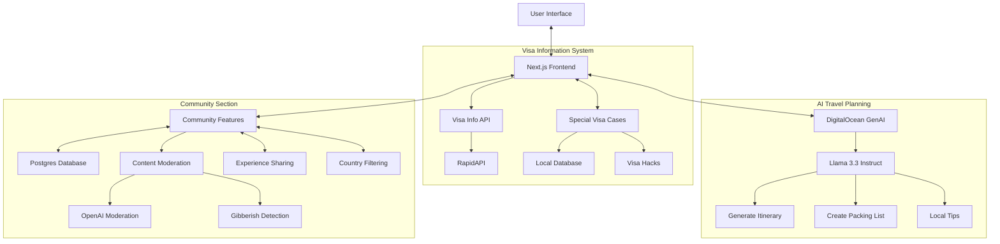

# Nomado - Your Smart Travel Companion 🌍✈️

Nomado is an application that helps travellers plan their next trips by providing instant visa information, personalized travel itineraries, and having a community where fellow travellers can share their travel stories. Built by a traveller for a traveller. 

## Features 🚀

- **Visa Information**: Get instant visa requirements for your travel destination
- **AI-Powered Trip Planning**: Generate personalized itineraries based on your preferences (number of days, month of visit)
- **Special Visa Cases**: Discover visa hacks and special cases for Indian passport holders
- **Community**: A section where users can share their travel stories for a particular country and other travellers can get real reviews of a country, what to do and what not to. 


## Tech Stack 💻

- **Frontend**: Next.js 14 with TypeScript
- **UI Framework**: Tailwind CSS with custom components
- **AI Integration**: DigitalOcean's GenAI Agent (Llama 3.3 Instruct)
- **Database**: DigitalOcean Postgres Database for the community section
- **APIs**: 
  - Visa Requirements API (RapidAPI)
  - Moderation API by OpenAI to prevent profanity in comments in the community section
  - Gibberish API by RapidAPI to prevent gibberish in comments in the community section
  - Custom API endpoints for special visa cases
- **Analytics**: Google Analytics

## TripAdvisor Flight Integration 🏨

The application integrates with TripAdvisor API to provide flight recommendations. The integration is implemented as a serverless function in DigitalOcean Functions. Learn [how to create a function namespace](https://docs.digitalocean.com/products/functions/getting-started/quickstart/) from the contol panel. 

### Configuration
```env
TRIPADVISOR_API_KEY=your_api_key
TRIPADVISOR_API_HOST=your_secret_key
TRIPADVISOR_API_URL=api_base_url
```

### Deployment
1. Install DigitalOcean CLI and connect to the function:
   ```bash
   brew install doctl
   doctl auth init
   doctl sls connect
   ```
2. Deploy the function:
   ```bash
   doctl serverless deploy flight-info
   ```

## Architecture Diagram 📐



## DigitalOcean GenAI Integration 🤖

The application uses DigitalOcean's GenAI agent (powered by Llama 3.3 Instruct) to generate personalized travel plans and provide intelligent travel assistance through a chatbot interface (powered by GPT-4o model). The integration works as follows:

### Trip Planning
1. User selects destination, trip duration, and visit month
2. Frontend sends request to server action
3. Server action communicates with DigitalOcean's GenAI agent
4. The agent generates comprehensive travel plan including:
   - Day-by-day itinerary
   - Weather-appropriate packing list
   - Local customs and cultural tips
   - Must-try local foods
   - Transportation recommendations

### AI Travel Assistant Chatbot 💬
The application features an intelligent chatbot powered by DigitalOcean GenAI with agent routing capabilities that provides:

- **Accommodation Suggestions**: Get personalized hotel and lodging recommendations based on budget, location preferences, and travel style
- **Cultural Do's and Don'ts**: Learn about local customs, etiquette, and cultural norms to avoid cultural faux pas
- **Scam Alerts**: Receive warnings about common tourist scams and how to avoid them
- **Local Tips**: Get insider knowledge about the destination from the AI assistant
- **Interactive Q&A**: Ask specific questions about your destination and get detailed, contextual responses

The chatbot uses DigitalOcean's agent routing to intelligently direct queries to the most appropriate knowledge base, ensuring accurate and helpful responses for travelers.

## Serverless Inference with DigitalOcean GenAI Platform ⚡

Nomado leverages DigitalOcean's Serverless Inference capabilities to generate itineraries without having to manage model deployments. This provides scalable, cost-effective AI inference that automatically scales based on demand. The implementation in the [generate-travel-plan.ts file](https://github.com/Haimantika/all-things-travel/blob/main/frontend/app/actions/generate-travel-plan.ts) uses the OpenAI-compatible client library to communicate with DigitalOcean's GenAI Platform:

```typescript
import OpenAI from 'openai';

const client = new OpenAI({
  apiKey: process.env.DO_GENAI_API_KEY,
  baseURL: "https://inference.do-ai.run/v1"
});

const response = await client.chat.completions.create({
  model: "llama3-8b-instruct",
  messages: [
    {
      role: "system",
      content: "You are a travel expert. Generate detailed, personalized itineraries."
    },
    {
      role: "user", 
      content: `Create a ${days}-day itinerary for ${destination} in ${month}.`
    }
  ],
  max_tokens: 2000,
  temperature: 0.7,
});
```

To set up serverless inference, create a model access key in the DigitalOcean GenAI Platform console and add `DO_GENAI_API_KEY=your_model_access_key_here` to your environment variables. You can read more about it in [this tutorial](https://www.digitalocean.com/community/tutorials/serverless-inference-genai).

## Getting Started 🏁

1. Clone the repository
2. Install dependencies:
   ```bash
   npm install
   ```
3. Set up environment variables:
   ```env
   # Database Configuration
   POSTGRES_HOST=db hostname
   POSTGRES_PORT=db port
   POSTGRES_USER=db usernames
   POSTGRES_PASSWORD=db passwords
   POSTGRES_DATABASE=db name

   # API Keys
   OPENAI_API_KEY=your openai key
   RAPIDAPI_KEY=your rapidaapi key
   ```
4. Run the development server:
   ```bash
   npm run dev
   ```

## Contributing 🤝

Contributions are welcome! Please feel free to open an issue, and then mention how you would like to contribute.

## License 📄

This project is licensed under the MIT License - see the [LICENSE](https://github.com/Haimantika/all-things-travel/blob/main/LICENSE) file for details.

## Author 👩‍💻

Made with ❤️ by [Haimantika](https://x.com/haimantikam)
