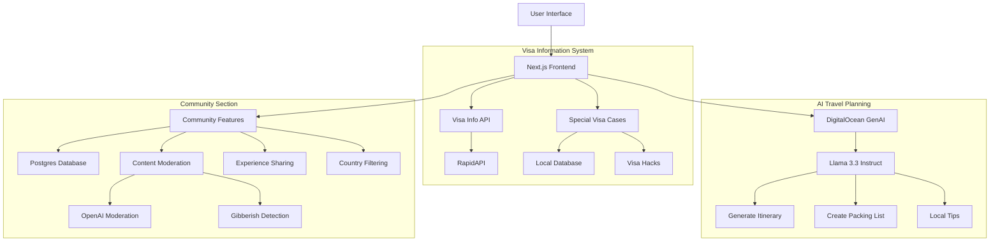

# Nomado - Your Smart Travel Companion 🌍✈️

Nomado is an application that helps travelers plan their next trips by providing instant visa information, personalized travel itineraries, and having a community where fellow travellers can share their travel stories. Built by a traveller for a traveller. 

## Features 🚀

- **Visa Information**: Get instant visa requirements for your travel destination
- **AI-Powered Trip Planning**: Generate personalized itineraries based on your preferences (number of days, month of visit)
- **Special Visa Cases**: Discover visa hacks and special cases for Indian passport holders
- **Community**: A section where users can share their travel stories for a particular country and other travellers can get real reviews of a country, what to do and what not to. 


## Tech Stack 💻

- **Frontend**: Next.js 14 with TypeScript
- **UI Framework**: Tailwind CSS with custom components
- **AI Integration**: DigitalOcean's GenAI Agent (Llama 3.3 Instruct)
- **Database**: DigitalOcean Postgres Database for the community section
- **APIs**: 
  - Visa Requirements API (RapidAPI)
  - Moderation API by OpenAI to prevent profanity in comments in the community section
  - Gibberish API by RapidAPI to prevent gibberish in comments in the community section
  - Custom API endpoints for special visa cases
- **Analytics**: Google Analytics

## Architecture Diagram 📐



## DigitalOcean GenAI Integration 🤖

The application uses DigitalOcean's GenAI agent (powered by Llama 3.3 Instruct) to generate personalized travel plans. The integration works as follows:

1. User selects destination, trip duration, and visit month
2. Frontend sends request to server action
3. Server action communicates with DigitalOcean's GenAI agent
4. The agent generates comprehensive travel plan including:
   - Day-by-day itinerary
   - Weather-appropriate packing list
   - Local customs and cultural tips
   - Must-try local foods
   - Transportation recommendations

## Getting Started 🏁

1. Clone the repository
2. Install dependencies:
   ```bash
   npm install
   ```
3. Set up environment variables:
   ```env
   POSTGRES_HOST=db hostname
   POSTGRES_PORT=db port
   POSTGRES_USER=db usernames
   POSTGRES_PASSWORD=db passwords
   POSTGRES_DATABASE=db name
   OPENAI_API_KEY=your openai key
   RAPIDAPI_KEY=your rapidaapi key
   NEXT_PUBLIC_GA_ID= Google Analytics ID
   ```
4. Run the development server:
   ```bash
   npm run dev
   ```

## Contributing 🤝

Contributions are welcome! Please feel free to open an issue, and then mention how you would like to contribute.

## License 📄

This project is licensed under the MIT License - see the LICENSE file for details.

## Author 👩‍💻

Made with ❤️ by [Haimantika](https://x.com/haimantikam)